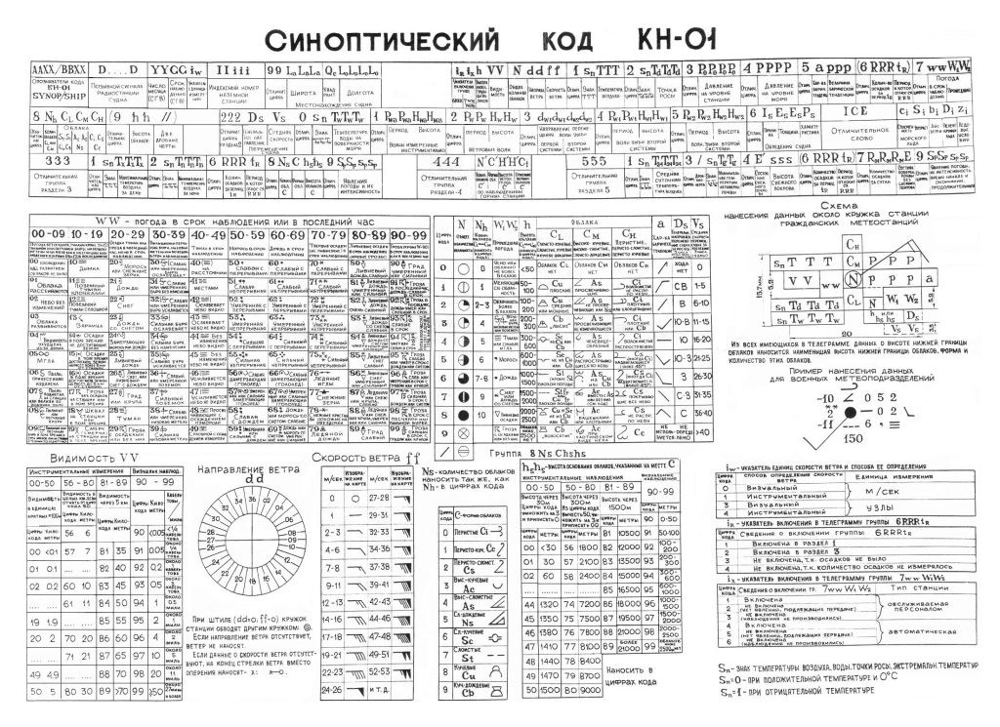
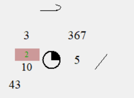

# Программа для дешифровки метеорологического кода КН-01

## Описание

Эта программа была разработана для упрощения дешифровки метеорологического кода КН-01, выданного на Военной кафедре. Программа использует приведённую ниже инструкцию для дешифровки кода.

## Инструкция по использованию

1. Чтобы вставить в программу текст, используйте `Ctrl + C` и `Ctrl + V`. Работает только на английской раскладке! Смените язык по необходимости.
2. По ошибкам писать В ВК: @1vitgar
3. При некорректном отображении данных сверить расстановку пробелов в коде КН-01.
4. Знак '=' в конце ввода не оставлять. В начале не ставить (см. пример ниже).
5. При появлении данных группы ww (цифра будет подсвечена зелёным цветом) использовать таблицу приведённую ниже.

## Пример зашифрованного кода

## СТРАНИЦА 1
2206127225 42997 03103 10034 21066 30170 40304 55001=2206127333 82598 12704 10035 21038 30123 40283 57003 81100=2206127532 42997 32405 10023 21040 30092 40308 57011 83030=2206127648 82597 82504 10023 21039 30160 40329 57006 87501=2206127329 42997 23104 10038 21051 30172 40300 58006 80001=2206127643 42997 62202 10029 21046 30180 40324 56009 86034 333 91005 91106=2206127835 42997 32201 10011 21039 30196 40358 52002 82032 333 21061=2206127208 12997 22903 10037 21071 30151 40329 53001 60002 80001 333 21030 43027=2206127316 12998 22702 10015 21053 30142 40318 57004 60002 80001 333 21038 43020=2206127347 42997 62803 10028 21035 30132 40289 57012 80070=2206127417 12997 22502 10040 21041 30128 40337 57005 60002 80001 333 21048 43008=2206127707 12997 02401 10026 21059 30067 40367 54000 60002 333 21019 44009=2206127817 12998 01401 10030 21041 30122 40374 52008 60002 333 21030 3/107 43018=2206127824 12997 02303 10028 21035 30017 40365 52004 60002 333 21016 43029 555 53005=2206127848 42997 62402 10022 21068 30172 40354 52001 80004 333 3/109=2206127906 12998 01501 10023 21041 30129 40376 52010 60002 333 21037 3/107 42013=2206127928 42997 02002 11007 21048 30160 40375 52007 333 21044=2206127930 42960 22603 11013 21048 30118 40370 52005 80001 333 21058=2206127935 42997 62302 10014 21031 30164 40365 52006 80008 333 21045=2206127947 41960 20000 10003 21043 30203 40367 52005 70240 80001 333 21080=2206127957 42997 02401 10008 21070 30146 40361 52008=2206127901 12997 01801 10011 21037 30100 40379 52005 60002 333 21033 3/105 43008 555 53004=2206127848 42997 62402 10022 21068 30172 40354 52001 80004 333 3/109=2206127705 12997 02502 10027 21060 30084 40360 54001 60002 333 21021 43016 555 53004=2206127316 12998 22702 10015 21053 30142 40318 57004 60002 80001 333 21038 43020 555 53005=2206127347 42997 62803 10028 21035 30132 40289 57012 80070=2206127428 42997 02801 10041 21044 30087 40319 57008 333 21046=2206127507 12998 00000 10019 21036 30118 40364 55001 60002 333 21056 44016 555 53000=2206127539 42498 52502 10031 21031 30150 40321 57011 83905=2206127606 12998 02301 10032 21057 30105 40353 57002 60002 333 21039 3/105 43009 555 53003=2206127627 12970 02504 10045 21036 30071 40347 57004 60002 333 21015 43019 555 53007=2206127745 42998 82102 10004 21057 30193 40340 57006 80001=2206127821 12998 02802 10007 21045 30076 40368 52001 60002 333 21043 43021 555 53005=2206127921 12997 12502 10030 21040 30098 40374 52006 60002 81030 333 21026 44026 555 53006=2206127208 12997 22903 10037 21071 30151 40329 53001 60002 80001 333 21030 43027 555 53006=2206127225 42997 03103 10034 21066 30170 40304 55001=2206127329 42997 23104 10038 21051 30172 40300 58006 80001=2206127333 82598 12704 10035 21038 30123 40283 57003 81100=2206127402 12997 22901 10042 21058 30156 40338 56003 60002 80001 333 21021 43019 555 53003=2206127532 42997 32405 10023 21040 30092 40308 57011 83030=2206127612 62970 02601 10047 21044 30145 40334 57005 60002 333 21013 43009 555 53004=2206127719 12997 02601 10018 21038 30110 40368 52007 60002 333 21035 42013 555 53005=2206127730 42997 12302 10033 21023 30147 40345 55004 80001=2206127835 42997 32201 10011 21039 30196 40358 52002 82032 333 21061=2206127935 42997 62302 10014 21031 30164 40365 52006 80008 333 21045=2206127848 42997 62402 10022 21068 30172 40354 54001 80004=2206127935 42997 6//// 2//// 3//// 4//// 5//// 80008=2206127957 42997 02401 10008 21070 30146 40361 52008=2206127809 12997 00000 10006 21060 30124 40376 52005 60002 333 21035 3/107 2206127915 12997 02402 10026 21040 30041 40373 52010 60002 333 21017 3/108 43030 555 53004=2206127923 42997 62304 10006 21037 30101 40368 52004 86030 333 21048=2206127704 12997 02901 10021 21060 30081 40364 58001 60002 333 21046 43007 555 53003=2206127717 12970 02302 10046 21042 30089 40363 52001 60002 333 21033 43014 555 53004=2206127213 42997 33104 10044 21056 30164 40303 54000 80001=2206127215 12998 03103 10028 21057 30102 40313 57001 60002 333 21023 43036 555 53008

## СТРАНИЦА 2
2206127217 12998 22703 10033 21060 30140 40318 57004 60002 80001 333 21048 43021 555 53007=2206127235 42997 02903 10036 21057 30087 40284 55003 333 20008 2206127401 12997 22902 10050 21049 30128 40345 56004 60002 80001 333 21014 43015 555 53004 2206127417 12997 22502 10040 21041 30128 40337 57005 60002 80001 333 21048 43008 555 53004 2206127419 62497 13002 10037 21046 30104 40330 57005 60002 81500 333 21016 43017 555 53004 2206127425 82997 02802 10041 21046 30091 40310 57006 2206127437 42998 22301 10034 21047 30115 40306 56008 81032=2206127502 12997 10000 10031 21054 30100 40347 57003 60002 80001 333 21048 43017 555 53002 2206127509 62970 02901 10033 21052 30122 40357 54000 60002 333 21048 43009 555 53002 2206127511 12997 20000 10020 21033 30137 40339 57004 60002 80001 333 21061 43017 555 53002 2206127526 42998 02603 10030 21025 30133 40318 57011=2206127523 12997 02001 10049 21033 30155 40323 57008 60002 333 21023 3/105 43007 555 53003 2206127538 62970 62402 10045 21020 30159 40321 57011 60002 83039 333 21051 43014 555 53005=2206127543 42997 82202 10030 21022 30141 40295 58017 80009 2206127611 12997 02802 10032 21045 30107 40349 57002 60002 333 21050 3/107 43014 555 53004 2206127618 12997 02501 10038 21038 30141 40347 55004 60002 333 21034 3/104 43006 555 53004 2206127625 62970 02401 10061 21029 30193 40335 57007 60002 333 21042 43014 555 53004=2206127636 42497 22501 10018 21018 30174 40330 57008 82901=2206127704 12997 02901 10021 21060 30081 40365 54000 60002 333 21046 3/107 43007 555 53003=2206127729 42997 12404 10027 21016 30134 40353 57002 80001 333 21026=2206127736 42997 62202 10036 21049 30222 40347 57004 83031=2206127906 12998 01501 10023 21041 30129 40376 52010 60002 333 21037 3/107 42013 555 53002=2206127928 42997 02002 11007 21048 30160 40375 52007 333 21044=2206127947 41960 20000 10003 21043 30203 40367 52005 70240 80001 333 21080=2206127514 12960 22705 10040 21037 40332 57004 60002 80001 333 21015=2206127524 12960 02302 10033 21056 40346 55001 60002 333 21022=2206127613 12960 22805 10037 21054 40339 57002 60002 82030 333 21034=2206126781 62998 03001 10037 21030 30080 40383 53002 60002 333 21025 43021=2206126275 12998 02702 10024 21038 30334 40365 53001 60002 333 21033 42007=2206126285 12998 30000 10005 21031 30281 40363 52001 60002 80001 333 21069 43033=2206126378 12998 00000 10002 21022 30286 40377 57001 60002 333 21075 42008=2206126389 12997 02802 10030 21046 30091 40362 57001 60002 333 21035 43023=2206126393 12998 02902 10027 21051 30133 40346 52002 60002 333 21024 43029=2206126477 12997 02601 10019 21022 30249 40383 57001 60002 333 21055 42999=2206126578 12997 00000 11012 21024 30174 40387 52002 60002 333 21077 43015=2206126585 12999 02502 10010 21039 30093 40376 57001 60002 333 21040 47013=2206126695 12997 03002 10031 21051 30056 40367 57002 60002 333 21036 44017=2206126795 12997 03202 10041 21048 30071 40370 54001 60002 333 21045 43018=2206126882 12998 03301 10034 21035 30092 40375 54000 60002 333 21012 42024=2206126894 12997 01501 10010 21028 30150 40375 54000 60002 333 21050 3/111 42002=2206126898 12998 01901 10044 21032 30105 40376 52003 60002 333 21008 3/107 43011=2206126976 12997 03301 10022 21017 30192 40380 52003 60002 333 21033 34101=2206126997 12997 00000 10049 21017 30153 40376 52006 60002 333 21012 34101=2206126774 32964 03404 10015 21014 30132 40388 53002 333 21028 42009 555 90011=2206126878 32967 00000 10058 21003 30164 40376 54000 333 21004 555 90020=2206126966 32981 00000 10024 21012 30206 40386 57001 333 21013 555 90011=2206126763 32960 02901 10025 21011 30148 40383 53002 333 21035 41998 555 90010=2206126887 32965 00000 10022 21014 30163 40375 53003 333 21020 41998 555 90010=2206126666 32968 00000 10006 21023 30166 40391 52003 333 21020 42005 555 90010=2206126862 32962 00000 10037 21021 30192 40385 54000 333 21027 555 90011=2206126378 12998 00000 10002 21022 30286 40377 57001 60002 333 21075 42008=2206126393 12998 02902 10027 21051 30
133 40346 52002 60002 333 21024 43029 555 53004=2206126488 62997 00000 10013 21032 30054 40368 57001 60002 333 21075 43024 555 53000=2206126585 12999 02502 10010 21039 30093 40376 57001 60002 333 21040 47013 555 53005=2206126795 12997 03202 10041 21048 30071 40370 54001 60002 333 21045 43018 555 53005 2206126298 12998 02802 10034 21053 30110 40346 52001 60002 333 21023 43020 555 53005 

## СТРАНИЦА 3
2206126389 12997 02802 10030 21046 30091 40362 57001 60002 333 21035 43023 555 53004=2206126695 12997 03002 10031 21051 30056 40367 57002 60002 333 2103644017 555 53003=2206126781 62998 03001 10037 21030 30080 40383 53002 60002 333 21025 43021 555 53004=2206126882 12998 03301 10034 21035 30092 40375 54000 60002 333 21012 42024 555 53005=2206126275 12998 02702 10024 21038 30334 40365 53001 60002 333 21033 42007=2206126976 12997 03301 10022 21017 30192 40380 52003 60002 333 21033 34101 555 53003=2206126894 12997 01501 10010 21028 30150 40375 54000 60002 333 21050 3/111 42002 555 53002=2206126996 12997 00000 10035 21037 30116 40375 52006 60002 333 21023 3/106 42010 555 53006=2206126985 12997 00000 10024 21019 30144 40380 52003 60002 333 21044 34102 555 53003=2206126672 86/// /2601 11021 21028 30171 40386 52004 333 21075 555 53002=2206126499 12998 12902 10039 21048 30117 40350 57003 60002 80001 333 21044 44015 555 53004=2206126578 12997 00000 11012 21024 30174 40387 52002 60002 333 21077 43015 555 53002=2206126783 12998 00000 10024 21038 30083 40377 54000 60002 333 21060 44018 555 53003=2206126896 12997 00000 10050 21044 30128 40370 52001 60002 333 21059 42005 555 53002=2206126898 12998 01901 10044 21032 30105 40376 52003 60002 333 21008 3/107 43011 555 53004=2206126997 12997 00000 10049 21017 30153 40376 52006 60002 333 21012 34101 555 53005=2206134003 12998 01902 10035 21037 30062 40376 52012 60002 333 21026 3/108 43013=2206134009 12997 01802 10040 21032 30069 40380 52016 60002 333 20003 3/104 42008=2206134013 12998 00000 10036 21035 30152 40379 51010 60002 333 21045 3/108 43012=2206134047 42998 03001 11024 21059 30186 40375 52012=2206134109 12999 00501 10030 21026 30139 40381 52019 60002 333 21014 3/101 42003=2206134123 42997 01401 10036 21031 30186 40373 52011 333 21032=2206134139 42961 00901 10001 21055 30127 40375 52017 333 21055=2206134146 42997 00000 10021 21052 30238 40374 52014=2206134231 42998 00301 10005 21043 30229 40377 52018 333 21060=2206134238 42997 00000 11009 21046 30179 40376 52013 333 21078=2206133041 32967 03401 10039 20001 30224 40385 53005 333 21004 555 90011=2206134036 42997 02601 10005 21051 30164 40371 52008 333 21082 3/113=2206134109 12999 00501 10030 21026 30139 40381 52019 60002 333 21014 3/101 42003 555 53004=2206134003 12998 01902 10035 21037 30062 40376 52012 60002 333 21026 3/108 43013 555 53008=2206134013 12998 00000 10036 21035 30152 40379 51010 60002 333 21045 3/108 43012 555 53004=2206134109 12999 00501 10030 21026 30139 40381 52019 60002 333 21014 3/100 42003 555 53004=2206134146 42997 00000 10021 21052 30238 40374 52014=2206134231 42998 00301 10005 21043 30229 40377 52018 333 21060=2206134116 12999 09901 10004 21029 30101 40377 52013 60002 333 21015 44010 555 53009=2206133166 12998 00801 10041 21040 30121 40380 52014 60002 333 20020 32101 555 53008=2206134001 12998 00000 10023 21032 30113 40381 52011 60002 333 21047 3/105 42004 555 53004=2206134036 42997 02601 10005 21051 30164 40371 52008 333 21082=2206134112 12997 02102 10031 21035 30048 40380 52014 60002 333 21009 3/105 42008 555 53006=2206134009 12997 01802 10040 21032 30069 40380 52016 60002 333 20003 3/104 42008 555 53008=2206134116 12999 09901 10004 21029 30101 40377 52013 60002 333 21015 44010 555 53009

## Таблицы и схемы

### Синоптический код КН-01

### Пример отображения для группы ww

### Таблица для группы ww

## Ошибки и исправления

До версии 1.2 была допущена ошибка: неверно отображались данные о давлении в разделе 4. Если значение меньше 900, необходимо делить на 10 и прибавлять 1000. Если значение в диапазоне 900-1000, делить на 10. Ошибка была исправлена в версии 1.2.

## Контакты

Для связи и сообщения об ошибках:
- ВК: @1vitgar

